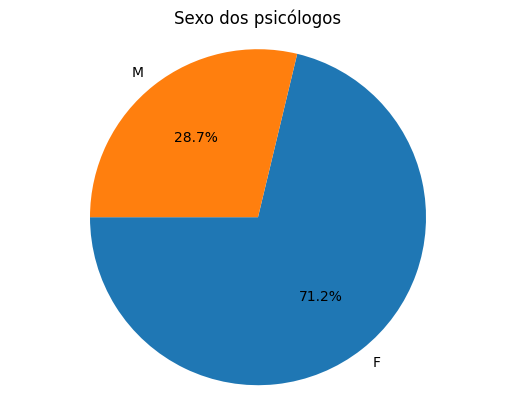
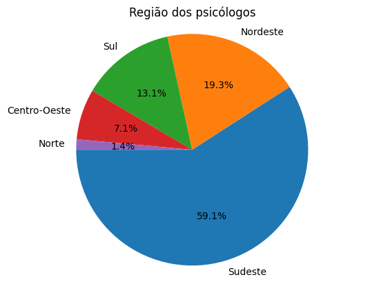
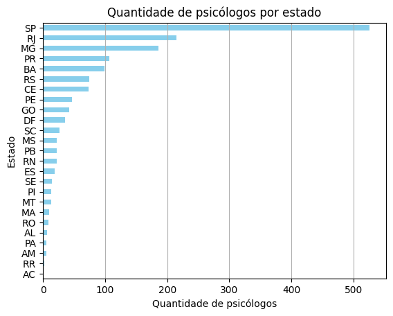
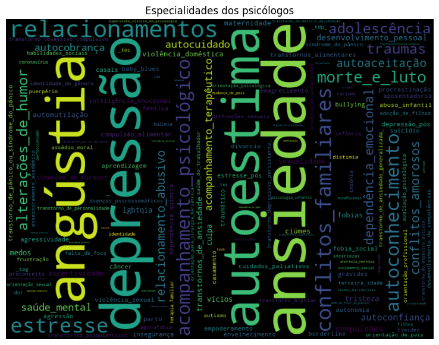
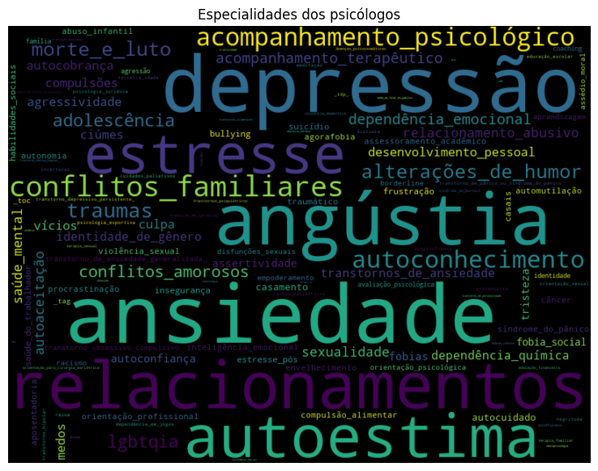

# Estudo sobre o site PsyMeet

## Bibliotecas utilizadas
```python
from data.mysqls import BancoDeDados
import pandas as pd
from utils.psymeet import PsyMeet
from matplotlib import pyplot as plt
from wordcloud import WordCloud

```

## Instalação
Requerimentos:
1) Python 3.12
2) Jupyter Notebook
3) Google Chrome

É necessário executar o comando:
```python
pip install -r requirements.txt

```


### Scrapping

Para realizar o scrapping do site do PsyMeet utilizamos o código: 

```python
PsyMeet().scrape()
```
 Ao executarmos, o scrapping ocorrerá e todos os dados encontrados serão salvos no arquivos 'psicologos.json' na pasta 'data' do diretorio.

### Criação do Dataframe
```python
df = pd.read_json('data/psicologos.json')

# Inicializar listas para armazenar os dados
crps = []
nomes = []
links = []
especialidades_list = []
sexos = []
estados = []

# Percorrer todo o df e ler e salvar os dados de forma de tabela
for index, row in df.iterrows():
    elemento  =  row[0]
    crps.append(elemento['crp'])
    nomes.append(elemento['nome'])
    links.append(elemento['link'])
    especialidades_list.append(elemento['especialidades'])
    sexos.append(elemento['sexo'])
    estados.append(elemento['estado'])

# Criar um novo DataFrame a partir dos dados extraídos
dados = pd.DataFrame({
    'crp': crps,
    'nome': nomes,
    'link': links,
    'especialidades': especialidades_list,
    'sexo': sexos,
    'estado': estados
})
```
Logo após a criação do Dataframe "**dados**", usaremos o **.describe()** para vizualizarmos como está estruturado o dataframe.
```python
dados.describe()
```


<div>
<style scoped>
    .dataframe tbody tr th:only-of-type {
        vertical-align: middle;
    }

    .dataframe tbody tr th {
        vertical-align: top;
    }

    .dataframe thead th {
        text-align: right;
    }
</style>
<table border="1" class="dataframe">
  <thead>
    <tr style="text-align: right;">
      <th></th>
      <th>crp</th>
      <th>nome</th>
      <th>link</th>
      <th>especialidades</th>
      <th>sexo</th>
      <th>estado</th>
    </tr>
  </thead>
  <tbody>
    <tr>
      <th>count</th>
      <td>1600</td>
      <td>1600</td>
      <td>1600</td>
      <td>1600</td>
      <td>1600</td>
      <td>1600</td>
    </tr>
    <tr>
      <th>unique</th>
      <td>1068</td>
      <td>1068</td>
      <td>1068</td>
      <td>1008</td>
      <td>2</td>
      <td>25</td>
    </tr>
    <tr>
      <th>top</th>
      <td>05/45909</td>
      <td>Rachel da Silva Ribeiro Barreto</td>
      <td>https://www.psymeetsocial.com/psicologo/rachel...</td>
      <td>[Ansiedade, Depressão, Relacionamentos, Angúst...</td>
      <td>F</td>
      <td>SP</td>
    </tr>
    <tr>
      <th>freq</th>
      <td>2</td>
      <td>2</td>
      <td>2</td>
      <td>25</td>
      <td>1140</td>
      <td>526</td>
    </tr>
  </tbody>
</table>
</div>


## Gráficos
### Sexo dos psicólogos
```python
valores_sexos = dados['sexo'].value_counts()
labels = valores_sexos.index
sizes = valores_sexos.values
fig1, ax1 = plt.subplots()
plt.title('Sexo dos psicólogos')
ax1.pie(sizes, labels=labels, autopct='%1.1f%%', startangle=180)
ax1.axis('equal')
plt.show()

```


    

    

#

### Região demográfica dos psicólogos
```python
regioes = {
    'Norte': ['AC', 'AM', 'AP', 'PA', 'RO', 'RR', 'TO'],
    'Nordeste': ['AL', 'BA', 'CE', 'MA', 'PB', 'PE', 'PI', 'RN', 'SE'],
    'Centro-Oeste': ['DF', 'GO', 'MT', 'MS'],
    'Sudeste': ['ES', 'MG', 'RJ', 'SP'],
    'Sul': ['PR', 'RS', 'SC']
}

dados['regiao'] = dados['estado'].apply(lambda x: [key for key, value in regioes.items() if x in value][0])
valores_regioes = dados['regiao'].value_counts()
labels = valores_regioes.index
sizes = valores_regioes.values
fig1, ax1 = plt.subplots()
plt.title('Região dos psicólogos')
ax1.pie(sizes, labels=labels, autopct='%1.1f%%', startangle=180)
ax1.axis('equal')
plt.show()

```


    

    


#
### Quantidade de psicólogos por estado
```python
valores_estados = dados['estado'].value_counts()
#colocar mais cores
valores_estados.plot(kind='barh', color='skyblue')
plt.gca().invert_yaxis()
plt.grid(axis='x')
plt.title('Quantidade de psicólogos por estado')
plt.xlabel('Quantidade de psicólogos')
plt.ylabel('Estado')
plt.show()


```


    

    


### Métodos para o WordCloud
```python
def wordcloud_especialidades(dados):
    texto = ''
    for index, row in dados.iterrows():
        for item in row['especialidades']:
            item = item.lower().split(' ')
            item = '_'.join(item)
            texto += item + ' '

    wordcloud = WordCloud(width=800, height=600, max_font_size=110, collocations=False).generate(texto)
    plt.figure(figsize=(14, 7))
    plt.title('Especialidades dos psicólogos')
    plt.imshow(wordcloud, interpolation='bilinear')
    plt.axis('off')
    plt.show()

def value_counts_especialidades(dados):
    especialidades = []
    for index, row in dados.iterrows():
        for item in row['especialidades']:
            especialidades.append(item)
    return pd.Series(especialidades).value_counts()


```

### WordCloud das especialidades do sexo feminino


```python
#fazer wordcloud com as especialidades baseado no sexo
dados_F = dados[dados['sexo'] == 'F']
wordcloud_especialidades(dados_F)
value_counts_especialidades(dados_F).head(5)

```


    

    


    Ansiedade          1059
    Depressão           925
    Angústia            851
    Autoestima          775
    Relacionamentos     744
    Name: count, dtype: int64


 ### WordCloud do sexo Masculino


```python
dados_M = dados[dados['sexo'] == 'M']
wordcloud_especialidades(dados_M)
value_counts_especialidades(dados_M).head(5)
```


    

    


    Ansiedade          408
    Depressão          377
    Angústia           310
    Relacionamentos    287
    Autoestima         245
    Name: count, dtype: int64


### Sobre
Lembrando que esse repositório serve apenas como base de estudo.