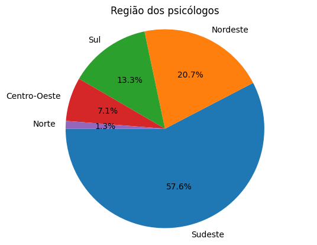
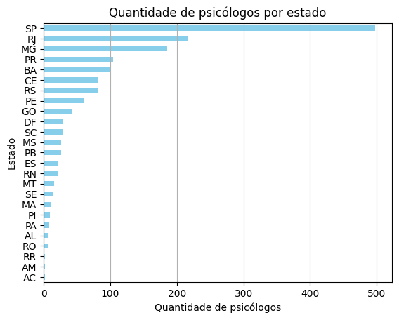
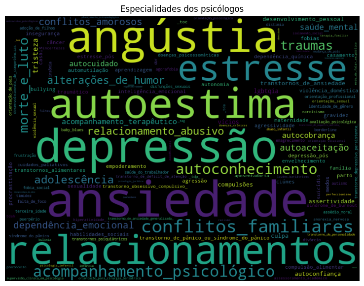
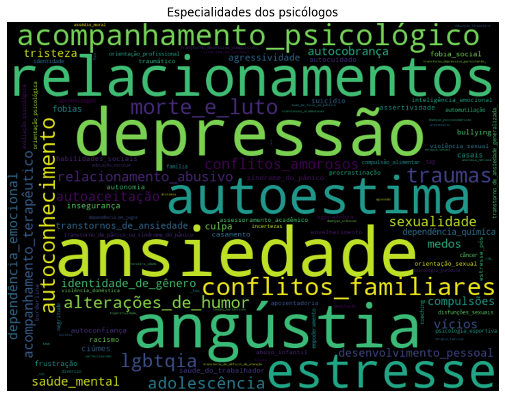

# Estudo sobre o site PsyMeet


Este projeto visa apresentar os estudos realizados sobre o site PsyMeet, uma plataforma online que oferece serviços de psicoterapia com um enfoque social. O site conta com mais de 800 profissionais cadastrados, cada um com sua área de especialidade e público-alvo específico. Essa diversidade nos permite realizar uma análise abrangente e detalhada do atendimento oferecido.

## Instalação
Requerimentos:
1) Python 3.12
2) Jupyter Notebook
3) Google Chrome

É necessário executar o comando:
```python
pip install -r requirements.txt

```
### Bibliotecas utilizadas


```python
import pandas as pd
from utils.psymeet import PsyMeet
from matplotlib import pyplot as plt
from wordcloud import WordCloud

```

### Scrapping

Para realizar o scrapping do site do PsyMeet utilizamos o código: 


```python
PsyMeet().scrape()
```

Ao executarmos, o scrapping ocorrerá e todos os dados encontrados serão salvos no arquivos 'psicologos.json' na pasta 'data' do diretorio.

### Criação do Dataframe


```python
# Ler o json e transformar em um dataframe
df = pd.read_json('data/psicologos.json')

# Inicializar listas para armazenar os dados
crps = []
nomes = []
links = []
especialidades_list = []
sexos = []
estados = []

# Percorrer todo o df e ler e salvar os dados de forma de tabela
for index, row in df.iterrows():
    elemento  =  row.iloc[0]
    crps.append(elemento['crp'])
    nomes.append(elemento['nome'])
    links.append(elemento['link'])
    especialidades_list.append(elemento['especialidades'])
    sexos.append(elemento['sexo'])
    estados.append(elemento['estado'])

# Criar um novo DataFrame a partir dos dados extraídos
dados = pd.DataFrame({
    'crp': crps,
    'nome': nomes,
    'link': links,
    'especialidades': especialidades_list,
    'sexo': sexos,
    'estado': estados
})


    
```

Logo após a criação do Dataframe "**dados**", usaremos o **.describe()** para vizualizarmos como está estruturado o dataframe.


```python
dados.head()
dados.describe()
```


<div>
<style scoped>
    .dataframe tbody tr th:only-of-type {
        vertical-align: middle;
    }

    .dataframe tbody tr th {
        vertical-align: top;
    }

    .dataframe thead th {
        text-align: right;
    }
</style>
<table border="1" class="dataframe">
  <thead>
    <tr style="text-align: right;">
      <th></th>
      <th>crp</th>
      <th>nome</th>
      <th>link</th>
      <th>especialidades</th>
      <th>sexo</th>
      <th>estado</th>
      <th>regiao</th>
    </tr>
  </thead>
  <tbody>
    <tr>
      <th>count</th>
      <td>1600</td>
      <td>1600</td>
      <td>1600</td>
      <td>1600</td>
      <td>1600</td>
      <td>1600</td>
      <td>1600</td>
    </tr>
    <tr>
      <th>unique</th>
      <td>812</td>
      <td>812</td>
      <td>812</td>
      <td>759</td>
      <td>2</td>
      <td>25</td>
      <td>5</td>
    </tr>
    <tr>
      <th>top</th>
      <td>07/27763</td>
      <td>Jéssica Silva Oliveira de Souza</td>
      <td>https://www.psymeetsocial.com/psicologo/jessic...</td>
      <td>[Ansiedade, Depressão, Relacionamentos, Angúst...</td>
      <td>F</td>
      <td>SP</td>
      <td>Sudeste</td>
    </tr>
    <tr>
      <th>freq</th>
      <td>2</td>
      <td>2</td>
      <td>2</td>
      <td>30</td>
      <td>1153</td>
      <td>498</td>
      <td>922</td>
    </tr>
  </tbody>
</table>
</div>


## Gráficos
### Sexo dos psicólogos


```python
valores_sexos = dados['sexo'].value_counts()
labels = valores_sexos.index
sizes = valores_sexos.values
fig1, ax1 = plt.subplots()
plt.title('Sexo dos psicólogos')
ax1.pie(sizes, labels=labels, autopct='%1.1f%%', startangle=180)
ax1.axis('equal')
plt.show()

print(valores_sexos)

```


    

    


    sexo
    F    1153
    M     447
    Name: count, dtype: int64
    

### Região demográfica dos psicólogos


```python
regioes = {
    'Norte': ['AC', 'AM', 'AP', 'PA', 'RO', 'RR', 'TO'],
    'Nordeste': ['AL', 'BA', 'CE', 'MA', 'PB', 'PE', 'PI', 'RN', 'SE'],
    'Centro-Oeste': ['DF', 'GO', 'MT', 'MS'],
    'Sudeste': ['ES', 'MG', 'RJ', 'SP'],
    'Sul': ['PR', 'RS', 'SC']
}

dados['regiao'] = dados['estado'].apply(lambda x: [key for key, value in regioes.items() if x in value][0])
valores_regioes = dados['regiao'].value_counts()
labels = valores_regioes.index
sizes = valores_regioes.values
fig1, ax1 = plt.subplots()
plt.title('Região dos psicólogos')
ax1.pie(sizes, labels=labels, autopct='%1.1f%%', startangle=180)
ax1.axis('equal')
plt.show()

print(valores_regioes)

```


    

    


    regiao
    Sudeste         922
    Nordeste        331
    Sul             213
    Centro-Oeste    114
    Norte            20
    Name: count, dtype: int64
    

### Quantidade de psicólogos por estado


```python
valores_estados = dados['estado'].value_counts()
#colocar mais cores
valores_estados.plot(kind='barh', color='skyblue')
plt.gca().invert_yaxis()
plt.grid(axis='x')
plt.title('Quantidade de psicólogos por estado')
plt.xlabel('Quantidade de psicólogos')
plt.ylabel('Estado')
plt.show()

print(valores_estados)


```


    

    


    estado
    SP    498
    RJ    217
    MG    185
    PR    104
    BA    100
    CE     82
    RS     81
    PE     60
    GO     42
    DF     30
    SC     28
    MS     26
    PB     26
    ES     22
    RN     22
    MT     16
    SE     14
    MA     12
    PI      9
    PA      8
    AL      6
    RO      6
    RR      2
    AM      2
    AC      2
    Name: count, dtype: int64
    

### Métodos para o WordCloud


```python
def wordcloud_especialidades(dados):
    texto = ''
    for index, row in dados.iterrows():
        for item in row['especialidades']:
            item = item.lower().split(' ')
            item = '_'.join(item)
            texto += item + ' '

    wordcloud = WordCloud(width=800, height=600, max_font_size=110, collocations=False).generate(texto)
    plt.figure(figsize=(14, 7))
    plt.title('Especialidades dos psicólogos')
    plt.imshow(wordcloud, interpolation='bilinear')
    plt.axis('off')
    plt.show()

def value_counts_especialidades(dados):
    especialidades = []
    for index, row in dados.iterrows():
        for item in row['especialidades']:
            especialidades.append(item)
    return pd.Series(especialidades).value_counts()


```

### WordCloud das especialidades do sexo feminino


```python
#fazer wordcloud com as especialidades baseado no sexo
dados_F = dados[dados['sexo'] == 'F']
wordcloud_especialidades(dados_F)
value_counts_especialidades(dados_F).head(5)

```


    

    


    Ansiedade          1076
    Depressão           912
    Angústia            871
    Autoestima          773
    Relacionamentos     764
    Name: count, dtype: int64


 ### WordCloud do sexo Masculino


```python
dados_M = dados[dados['sexo'] == 'M']
wordcloud_especialidades(dados_M)
value_counts_especialidades(dados_M).head(5)
```


    

    


    Ansiedade          401
    Depressão          371
    Angústia           317
    Relacionamentos    284
    Autoestima         245
    Name: count, dtype: int64


```python

```


```python

```
